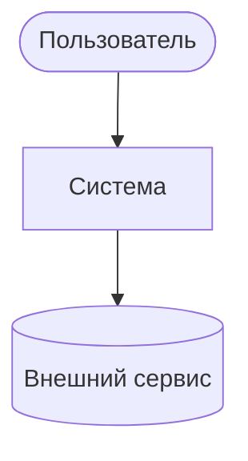
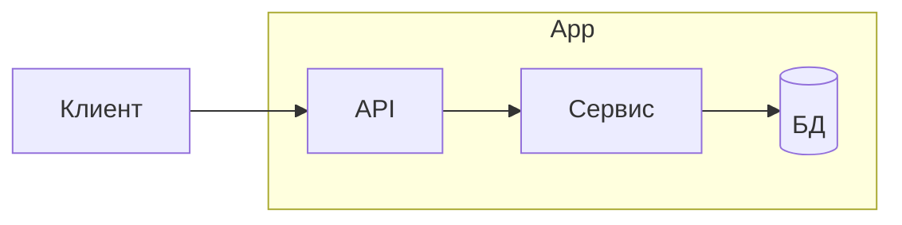
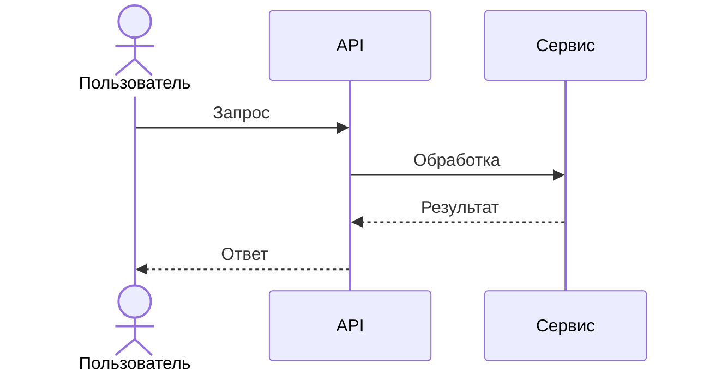
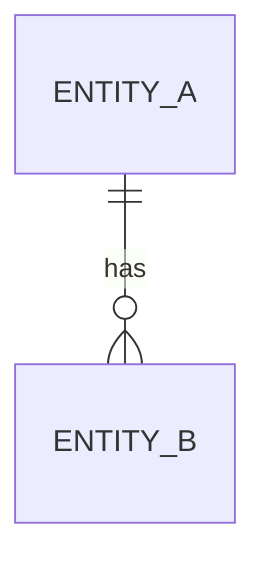

# <Название проекта> — Диаграммы архитектуры

> Шаблон. Скопируй в `projects/<project>/architecture-diagram.md`.
> Диаграммы в [Mermaid](https://mermaid.js.org/). Текстовое описание → [[architecture]].

## Контекст (C4: System Context)

## Контейнеры / компоненты

## Последовательность (ключевой сценарий)

## Модель данных (ER)

См. также: [[architecture]] · [[project-index]]
