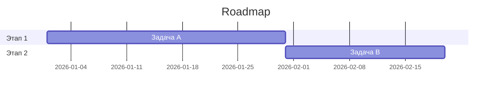

# <Название проекта> — Дорожная карта

> Шаблон. Скопируй в `projects/<project>/roadmap.md`.

## Видение
Куда движется проект в горизонте 6–12 месяцев.

## Этапы (milestones)
| Этап | Цель | Срок | Статус |
|------|------|------|--------|
| M1 | … | YYYY-Qn | planned / in-progress / done |

## Ближайший спринт / итерация
- [ ] Задача 1
- [ ] Задача 2

## Бэклог
- Идея/задача → ссылка на [[requirements]] при детализации.

## Временная шкала

См. также: [[requirements]] · [[release-notes]] · [[project-index]]
